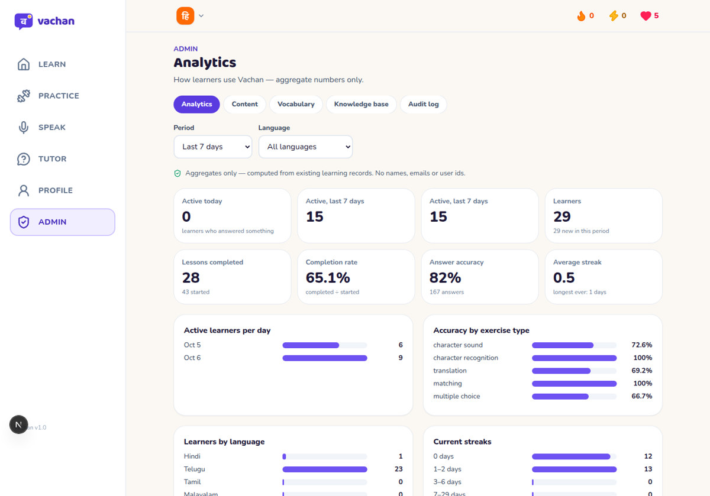

# Vachan — Admin dashboard guide (Phase 8)

The admin dashboard (`/admin`) lets a content team add and change everything learners see —
**without editing source code or re-running the seed**.



## 1. Become an admin

There is no sign-up for admins and no API to grant the role (so nobody can promote themselves).
From a terminal that can reach the database:

```bash
npm run admin:grant  -w backend -- you@example.com   # the account must already exist (register first)
npm run admin:list   -w backend                       # who is an admin
npm run admin:revoke -w backend -- you@example.com
```

For the deployed database, run the same command with that `DATABASE_URL` (see DEPLOYMENT.md).
Reload the app: an **Admin** item appears in the sidebar and an "Admin dashboard" card on the Profile page.

## 2. Sections

| Tab                | What you can do                                                                                                                                                                              |
| ------------------ | -------------------------------------------------------------------------------------------------------------------------------------------------------------------------------------------- |
| **Analytics**      | Active learners, lesson completion & drop-off, accuracy by exercise type, common mistakes, language usage, streaks, AI Tutor and speaking usage. Filters: period, language. Aggregates only. |
| **Content**        | Languages → courses → units → lessons: create, edit, reorder (↑ ↓), publish / unpublish, delete. "Show to learners" / "Hide language".                                                       |
| **Lesson editor**  | Title, intro, kind, the words it teaches (pick from vocabulary), and its exercises (all 7 types) with answers, reorder, delete.                                                              |
| **Vocabulary**     | Words, letters and phrases per language: search, add, edit, delete.                                                                                                                          |
| **Knowledge base** | The RAG notes the AI Tutor and role-plays search: write notes, preview chunks, publish (index), re-index, unpublish, delete.                                                                 |
| **Audit log**      | The last 100 changes: who did what, when.                                                                                                                                                    |

## 3. Publishing rules

A learner sees a lesson only when **all four** are published: the language ("Show to learners"),
the course, the unit and the lesson. Everything new starts **unpublished**, so you can build a whole
unit and publish it when it's ready.

- A lesson needs at least one exercise before it can be published (`409 LESSON_EMPTY`).
- A language needs a published course before it can be shown.
- Unpublishing hides content immediately but **keeps learners' progress**.

## 4. Adding a lesson (no code)

1. **Content** → choose the language → in a unit click **Add lesson** → title, intro text, kind →
   **Create and add exercises**.
2. In the lesson editor tick the words it teaches (add missing ones in **Vocabulary** first).
3. **Add exercise** → choose a type → fill in the prompt and options. The form shows problems as
   you type (e.g. "Mark exactly one option as correct"); the server checks the same rules the answer
   checker uses, so a saved exercise is always answerable.

   | Type                                                        | Options mean                                                        |
   | ----------------------------------------------------------- | ------------------------------------------------------------------- |
   | Multiple choice, character recognition/sound, fill in blank | 2–6 options, exactly one correct (fill-in also needs sentence text) |
   | Translation                                                 | accepted answers (ticked); unticked = extra word-bank words         |
   | Word order                                                  | each word's position 1, 2, 3 …; empty = distractor word             |
   | Matching                                                    | 2–6 pairs: left text + its match                                    |

4. **Publish lesson** (and the unit, if it's new).
5. Words changed? Open **Knowledge base** → **Re-index all** so the AI Tutor knows them.

## 5. Deleting safely

- Deleting something learners have already used is refused first: you see how many learner records
  depend on it and can **Unpublish** instead (keeps their progress) or **Delete anyway**.
- Exercises used by the placement test can't be deleted.
- Deleting the last exercise of a published lesson unpublishes the lesson.

## 6. Knowledge base (RAG) — safe re-indexing

| Origin            | Where the text lives                | What you can do here                   |
| ----------------- | ----------------------------------- | -------------------------------------- |
| Dashboard note    | the database (written here)         | everything: edit, publish, delete      |
| File              | `backend/knowledge-base/*.md` (git) | publish / unpublish, re-index, preview |
| Course vocabulary | generated from the Vocabulary list  | publish / unpublish, re-index, preview |

Workflow: **write** (saved as a draft — drafts are never searched) → **Preview chunks** (dry run:
each `## ` section becomes one chunk) → **Publish** (embeds and indexes it) → edit later → **Re-index**.

Why it is safe:

- The text is validated with the same parser as the files before it is saved (`400 INVALID_KNOWLEDGE_FORMAT`).
- Re-indexing one document replaces its chunks **in one transaction**: until the new chunks are saved,
  the old ones stay searchable. If embedding fails, the error is shown on the document and the old
  chunks are kept.
- Only one indexing job runs at a time (`409 INDEX_BUSY`).
- **Unpublish** removes the chunks immediately — the tutor stops citing the note at once.
- Badges: _Needs re-index_ (published text changed), _Index error_ (last attempt failed).

On a server with search turned off (Render free, `RAG_ENABLED=false`) you can still write and publish;
the dashboard tells you to run `npm run rag:index -w backend` against that database from your computer.

## 7. Analytics and privacy

Every number is an aggregate computed from records the app already keeps (answers, lesson progress,
daily activity, tutor messages, speaking attempts). No names, e-mails or user ids are sent to the
dashboard, and no extra tracking was added. Common-mistake rows need at least 3 answers so single
learners can't be singled out.

## 8. API

All dashboard actions are plain REST endpoints under `/api/admin/*` (admin token required) — see
[API.md §5e](API.md#5e-admin-dashboard--analytics-phase-8--folder-16) and Postman folder 16.
